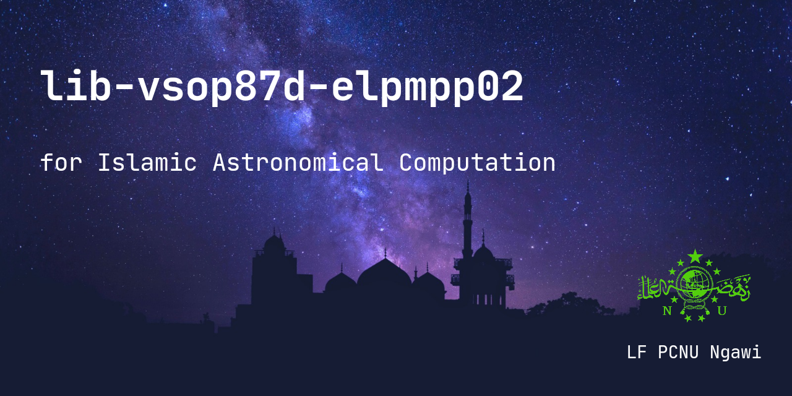

<p align="center">
  
</p>

<h2 align="center"><b>lib-vsop87d-elpmpp02</b></h2>
<p align="center">
<p><br>

<p align="center">
<!-- Latest release -->

<!-- Jitpack release -->

<!-- Github Repo size -->

<!-- Build with Kotlin -->

<!-- License -->

</p>

# Tentang lib-vsop87d-elpmpp02

VSOP87D merupakan Model teori planet (Planetary Theory) semi analitis matematika yang menggambarkan perubahan jangka panjang ( variasi sekuler ) dalam orbit planet Merkurius hingga Neptunus,
seri D merepresentasikan koordinat Heliocentric ecliptic spherical coordinates for the equinox of the day. Total suku koreksi VSOP87D: 2.425

ELPMPP02 adalah Model teori semi analitis pergerakan bulan yang dikembangkan oleh Jean Chapront, Michelle Chapront-Touzé, G. Francou dan lainnya di Bureau des Longitudes pada tahun 1970an hingga 1990an, ELPMPP02 merupakan peningkatan dari model ELP sebelumnya seperti ELP2000-82, ELP2000-85, ELP2000-82B. Total suku koreksi ELPMPP02: 35.901

lib-vsop87d-elpmpp02 menggunakan 2 model tersebut untuk mengetahui posisi matahari dan bulan secara presisi untuk keperluan falak hisab, rukyatul hilal, waktu sholat, arah qiblat, dll. Suku koreksi lengkap sebanyak 38.326 buah

Sedangkan untuk Nutation, menggunakan IAU 2000B

Referensi:
Sabda Abu. Ilmu Falak Rumusan Syar'i dan Astronomi Seri 03, 1 ed, DIY Yogyakarta, 2024. (telah direvisi via chat whatsapp pribadi)

Terinspirasi dari:
https://github.com/abusabda/hisab-astronomis.git

## Dokumentasi penggunaan

- [Dokumentasi](https://hasanelfalakiy.github.io/lib-vsop87d-elpmpp02/)

## Fitur

- [x] Ephemeris posisi matahari dan bulan
- [x] Arah qiblat & rashdul qiblat
- [x] Waktu sholat
- [x] Fase-fase bulan
- [x] Awal bulan hijriyah

## Konfigurasi pertama

1. Masukkan kode ini ke settings.gradle.kts (root kotlin dsl) di blok ```repositories```
```kotlin.kts
  dependencyResolutionManagement {
    repositories {
      // contoh
      maven {
        url = uri("https://jitpack.io")
      }
    }
  }
```
Jika menggunakan groovy dsl
```groovy
  repositories {
    maven { url 'https://jitpack.io' }
  }
```
2. Masukkan dependensi ke build.gradle.kts (app/build.gradle.kts kotlin dsl)
di dalam blok ```dependencies``` 

```kotlin.kts
implementation("com.github.hasanelfalakiy:lib-vsop87d-elpmpp02:${versi}")
```
jika menggunakan groovy dsl
```groovy
implementation 'com.github.hasanelfalakiy:lib-vsop87d-elpmpp02:${versi}'
```

## Ingin berkontribusi?
> Jika Anda ingin berkontribusi, silahkan menggarpu (Fork) repositori ini, clone ke local machine, buat perubahan, push ke repositori fork, kirim pull request ke repositori ini

## Modifikasi
> [!WARNING]
>
> Jika Anda ingin menyalin, memodifikasi, dan atau mendistribusikan ulang program ini, harap mematuhi ketentuan lisensi dari program ini.

## Kontak Kami

- [Telegram](https://t.me/moonelfalakiy)
- [Grup diskusi Telegram](https://t.me/moonlight_studio01/9)

## License

```
lib-vsop87d-elpmpp02

Copyright (C) 2024-2025  Andi Hasan Ashari

This program is free software: you can redistribute it and/or modify
it under the terms of the GNU General Public License as published by
the Free Software Foundation, either version 3 of the License, or
(at your option) any later version.

This program is distributed in the hope that it will be useful,
but WITHOUT ANY WARRANTY; without even the implied warranty of
MERCHANTABILITY or FITNESS FOR A PARTICULAR PURPOSE.  See the
GNU General Public License for more details.

You should have received a copy of the GNU General Public License
along with this program.  If not, see <https://www.gnu.org/licenses/>.
```
Report to us if anyone violates the terms of the License, either by creating issues or writing to us directly.
